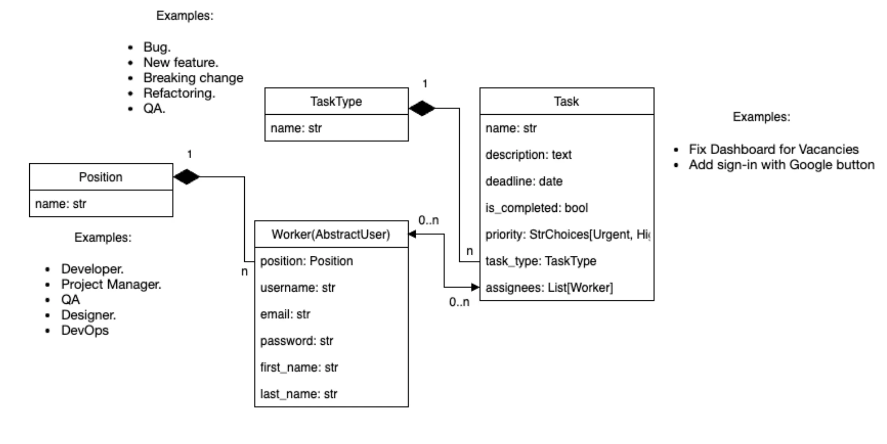

# taskmanager-mate
## For tests:
 link to site:   [TaskManager](https://taskmanager-mate.onrender.com)
- user: admin
- pass: admin

# TaskManager

TaskManager is a task management application built with Django. It allows users to manage tasks, track progress, and organize their workload efficiently.

## Features

- **Task Management**: Create, update, and delete tasks.
- **Task Types**: Categorize tasks with different types.
- **User Management**: User registration and authentication.
- **Responsive Design**: Optimized for both desktop and mobile devices.
- **Media Handling**: Upload and manage photos.

## Getting Started

To get a local copy of the project up and running, follow these steps:


### Environment setup

The project uses environment variables for configuration. For proper operation, you need to create a `.env` file that contains all the necessary variables.

In the root directory of your project, create a `.env` file and add the following environment variables to it:
```env
# Django secret key (change to your secret key)
DJANGO_SECRET_KEY=your_secret_key_here

# Debug mode (True or False)
DEBUG=True

# Database URL (e.g. PostgreSQL, MySQL, or SQLite)
DATABASE_URL=your_database_url_here

# Dropbox keys and tokens (if using)
DROPBOX_ACCESS_TOKEN=your_dropbox_access_token_here
DROPBOX_APP_KEY=your_dropbox_app_key_here 
DROPBOX_APP_SECRET=your_dropbox_app_secret_here DROPBOX_REFRESH_TOKEN=your_dropbox_refresh_token_here
```
The `.env` file should not be checked into the repository. This will help prevent leakage of sensitive information.

### Prerequisites

- Python 3.8 or higher
- Django 5.x
- pip

### Installation

1. **Clone the repository**:

    ```bash
    git clone https://github.com/yourusername/taskmanager.git
    ```

2. **Navigate to the project directory**:

    ```bash
    cd taskmanager
    ```

3. **Create a virtual environment**:

    ```bash
    python -m venv venv
    ```

4. **Activate the virtual environment**:

    - On Windows:

      ```bash
      venv\Scripts\activate
      ```

    - On macOS/Linux:

      ```bash
      source venv/bin/activate
      ```

5. **Install the dependencies**:

    ```bash
    pip install -r requirements.txt
    ```

6. **Apply migrations**:

    ```bash
    python manage.py migrate
    ```

7. **Create a superuser (optional)**:

    ```bash
    python manage.py createsuperuser
    ```

8. **Run the development server**:

    ```bash
    python manage.py runserver
    ```

9. **Open your web browser and go to** `http://127.0.0.1:8000/` to see the application in action.

## Usage

- **Register an Account**: Sign up and create a new account.
- **Log In**: Access your tasks and settings by logging in.
- **Manage Tasks**: Use the interface to add, edit, and delete tasks. And related additional data
- **Upload Photos**: Add photos of different workers.

## Database Schema

Here is the database schema for the project:



## Contributing

Contributions are welcome! Please follow these steps to contribute:

1. Fork the repository.
2. Create a new branch (`git checkout -b feature-branch`).
3. Make your changes.
4. Commit your changes (`git commit -am 'Add new feature'`).
5. Push to the branch (`git push origin feature-branch`).
6. Create a new Pull Request.

## License

This project is licensed under the MIT License - see the [LICENSE](LICENSE) file for details.

## Acknowledgements

- **Django**: The web framework used for this project.
- **Bootstrap**: For styling and responsive design.
- **django-crispy-forms**: For form rendering and styling.